<p align="center">
  
</p>

<p align="center">
  <strong>Cinema tickets for Pakistan: live seat maps, trailers, QR e-tickets, food add-ons, loyalty points and Urdu, with no page reloads.</strong>
</p>

<p align="center">
  
  
  
  
  
  
  
  
</p>

<p align="center">
  <a href="#getting-started">Getting started</a> ·
  <a href="#data-model">Data model (ERD)</a> ·
  <a href="#concurrency-and-locking">Locking</a> ·
  <a href="#caching">Caching</a> ·
  <a href="public/llms.txt">llms.txt</a>
</p>

---

BookMyMovie is a full-stack cinema booking platform. Visitors browse films, watch trailers, pick seats on a live map (or from inside a 3D model of the hall), add snacks and book. Customers get a signed QR e-ticket that also works offline and can go into Apple or Google Wallet. Box-office staff scan tickets, issue refunds and gift cards, and every change lands in an audit log.

Built by **[Syed Ahmer Shah](https://ahmershah.dev/)**, originally for the Aptech DISM project.

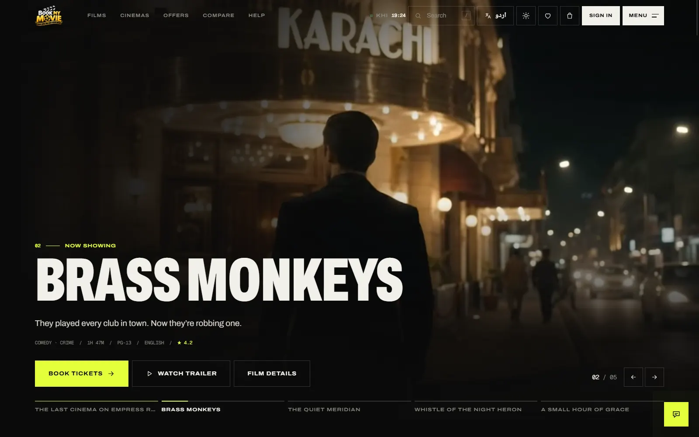

## Screenshots

| | |
| --- | --- |
| 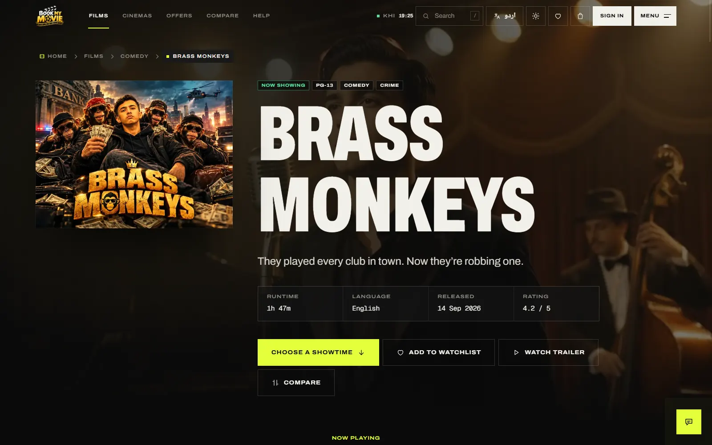 | 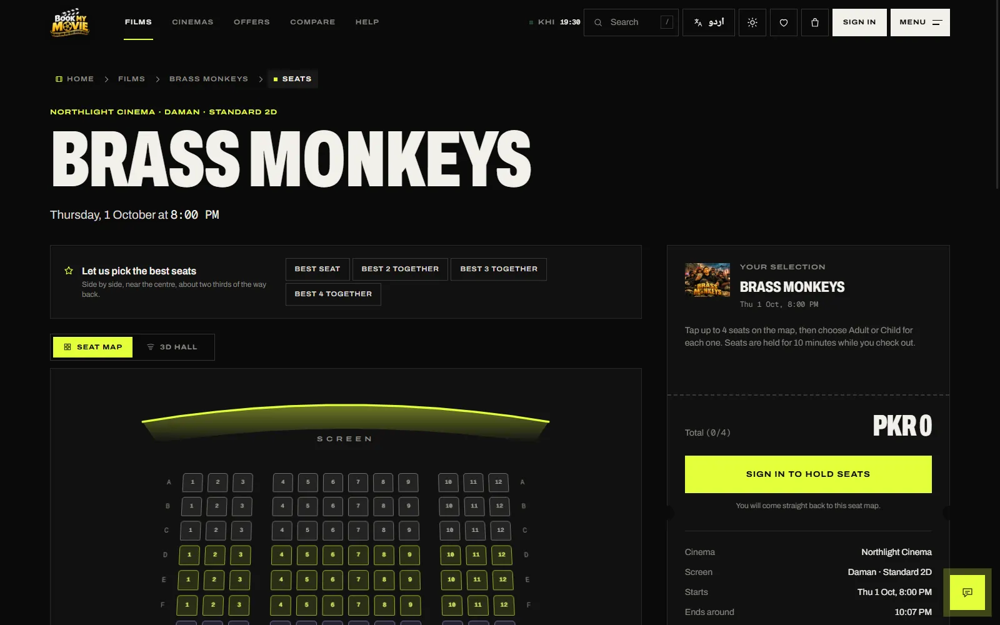 |
| **Film page**: poster, facts and a silent trailer backdrop | **Seat map**: row-tier prices, "best seats together", 10-minute hold |
| 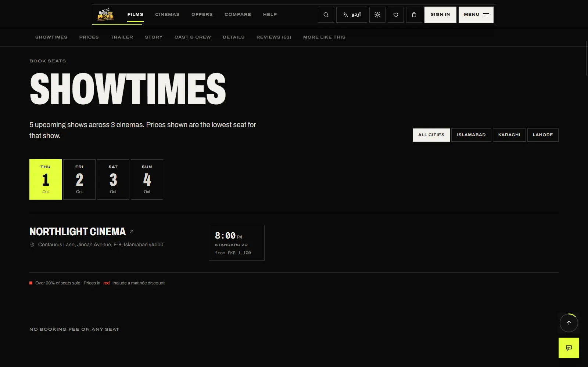 | 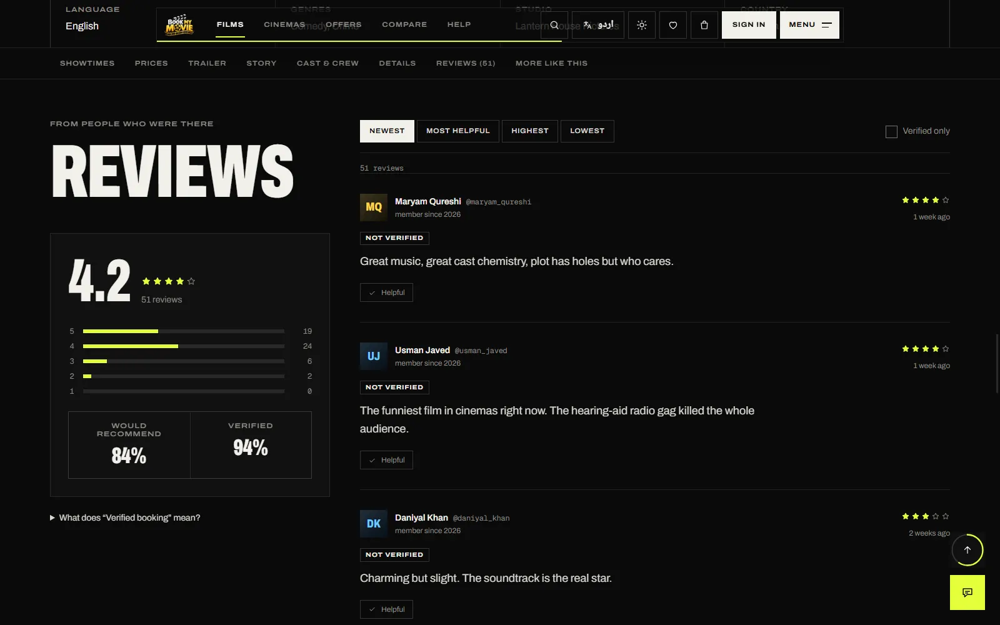 |
| **Showtimes**: next 7 days by cinema and city | **Reviews**: verified bookings only, photo reviews, sorting |
| 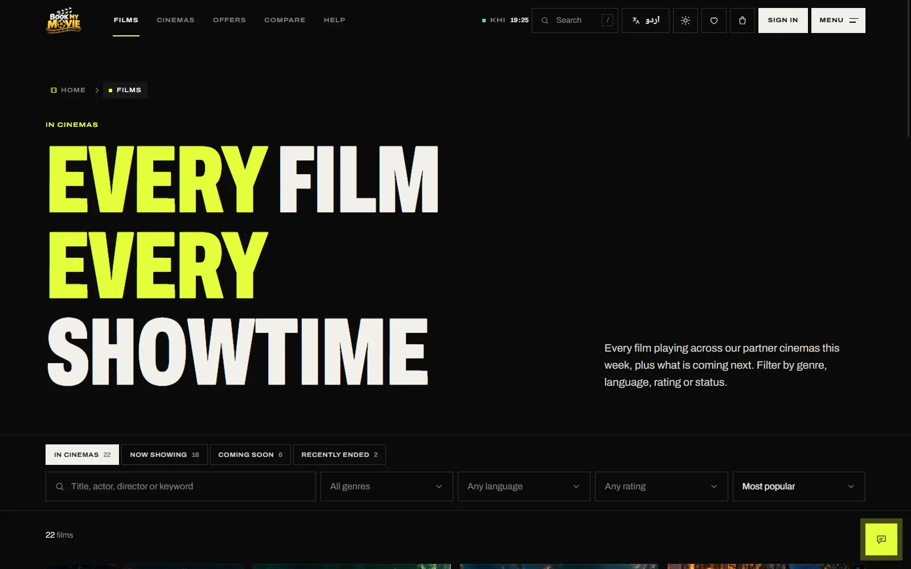 | 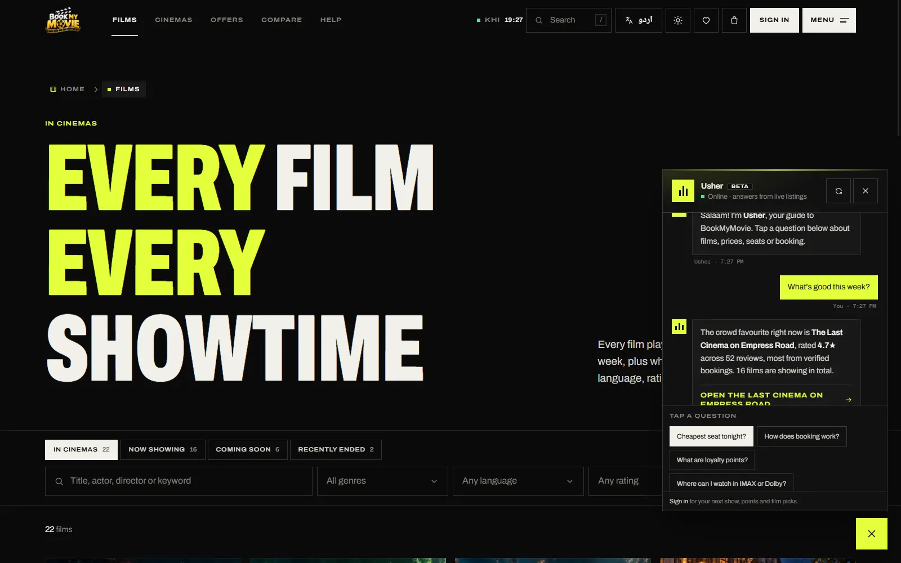 |
| **Catalogue**: search and filters, no page reloads | **Usher**: preset questions answered from live data |
| 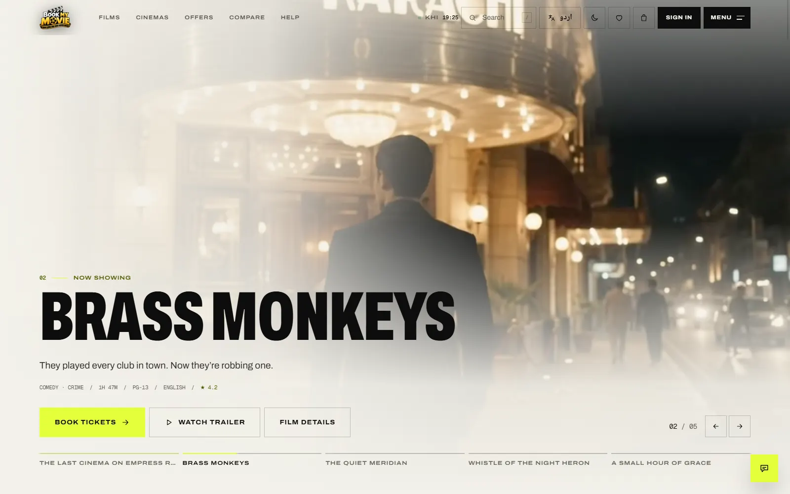 | 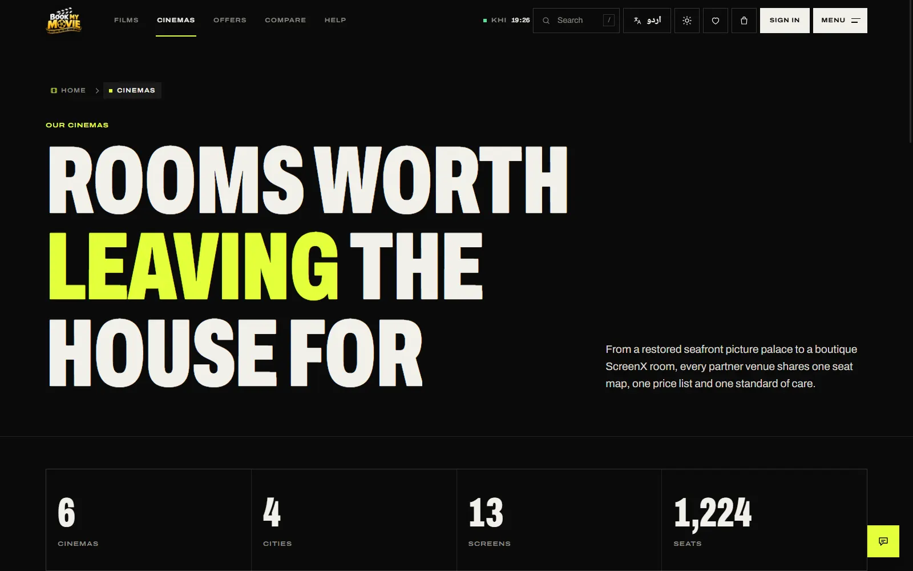 |
| **Light theme**: same tokens, WCAG AA in both themes | **Cinemas**: venues by city, formats and today's programme |

<p align="center">
  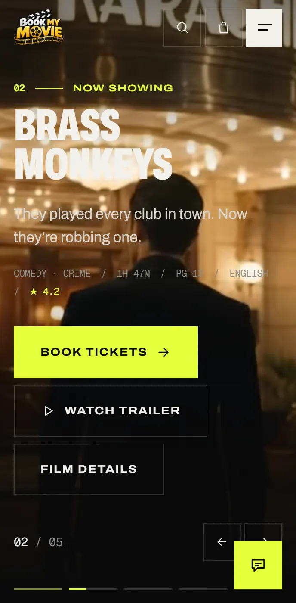&nbsp;
  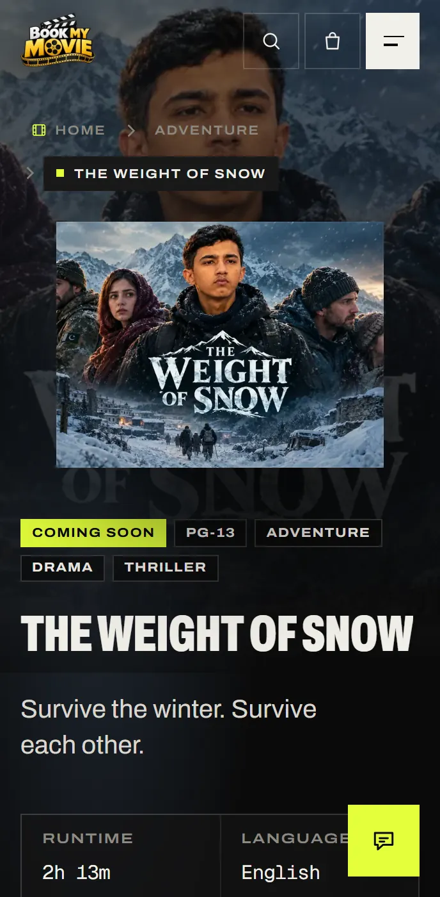&nbsp;
  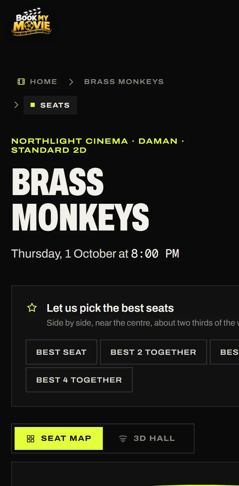&nbsp;
  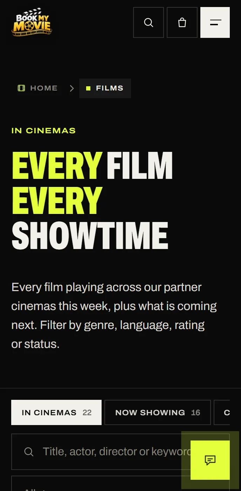
</p>

<details>
<summary><strong>Architecture, data model and lifecycle diagrams</strong></summary>

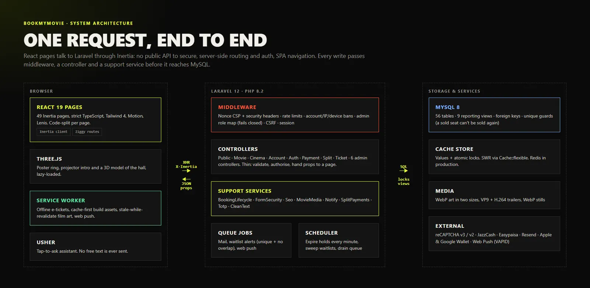
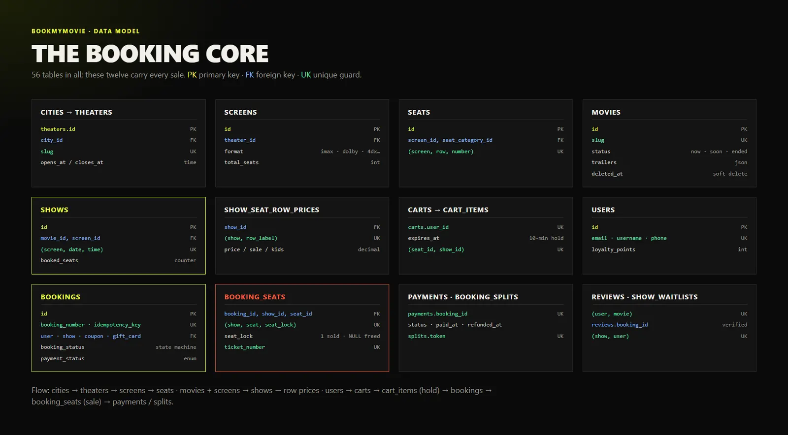
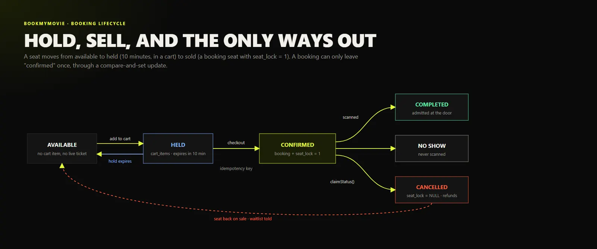

</details>

## Contents

1. [Features](#features)
2. [Tech stack](#tech-stack)
3. [Architecture](#architecture)
4. [Data model](#data-model)
5. [Booking lifecycle](#booking-lifecycle)
6. [Concurrency and locking](#concurrency-and-locking)
7. [Caching](#caching)
8. [Performance and media](#performance-and-media)
9. [Security](#security)
10. [Getting started](#getting-started)
11. [Configuration](#configuration)
12. [Film artwork and trailers](#film-artwork-and-trailers)
13. [Project layout](#project-layout)
14. [Tests](#tests)
15. [Licence](#licence)

## Features

### For moviegoers

| Area | What you get |
| --- | --- |
| **Films and trailers** | 4:3 card art on every listing, a 16:9 hero, and short trailers that play silently behind the home carousel and film pages (WebM first, MP4 fallback, WebP still before playback). |
| **Seats** | Row-tier pricing, a live seat map, **adult and child tickets in one booking**, and **"best 2 (or 4) together"** suggestions. Seats are held for 10 minutes with a live countdown in the navbar. |
| **See it from your seat** | A Three.js model of the hall: sit in any seat, watch the trailer on the screen as the lights dim, and get a view score (distance, screen coverage, off-centre angle, neck tilt). |
| **Sold out?** | A first-come **waitlist** that tells you the moment seats come back (a cancellation or an expired hold). |
| **Group bookings** | **Split the bill** into equal shares; each friend gets a private link and pays online or at the counter. |
| **Alerts** | In-app notifications and optional **web push**: a watchlisted film opening, seats opening on your waitlist. |
| **Checkout** | Snacks, coupons, **gift cards** and **loyalty points** in one step. Pay at the counter, or with JazzCash, Easypaisa or card once gateway keys are set. |
| **E-tickets** | A signed **QR code**, **Apple Wallet** / **Google Wallet** passes, and **offline access** through a service worker (installable PWA). |
| **Usher, the assistant** | A tap-to-ask helper. Signed-in customers get personal answers: their next show, points, which watchlist films are on sale, and a film pick based on the genres they book. There is no free-text box, so nothing typed is ever sent anywhere. |
| **Account** | Bookings, watchlist, profile photo, points history, **review photos** (re-encoded, location data stripped) and optional **two-step sign-in**. |
| **Urdu** | A full English/Urdu switch with right-to-left layout. Film titles, prices and booking numbers stay in Latin script so they match the ticket. |
| **Themes** | Dark and light themes built on one set of colour tokens, both checked for WCAG AA contrast. |

### For the box office

| Area | What you get |
| --- | --- |
| **Overview** | KPI cards, a revenue "skyline", trends, a heat map and a live timeline of today's shows. |
| **Movies & content** | Films, media, hero carousel, shows, row pricing, page SEO, the ticker and broadcasts. |
| **Revenue & occupancy** | Revenue per day, tickets, average ticket and seats filled by film and cinema over 7, 30 or 90 days. |
| **Coupons, stock & sales** | Coupons with hard use limits, snack stock with low-stock warnings, and a per-film switch for ticket sales. |
| **Staff & roles** | Owner, Manager and Box office roles enforced on every admin route; **TOTP two-step sign-in** with recovery codes. |
| **Bans** | Banning a member also blocks every IP and browser they used. |
| **Audit log** | Every data-changing action by admins and customers, searchable, with before/after values. |
| **Refunds** | One step: seats, coupon use, gift card balance and points all return, and the customer is emailed. |
| **Ticket check** | Scanning a ticket QR verifies its HMAC signature, shows seats and snacks, and admits the guests. |

## Tech stack

| Layer | Tools |
| --- | --- |
| Backend | PHP 8.2+, Laravel 12, Eloquent, Inertia (server adapter), Ziggy |
| Frontend | React 19, TypeScript (strict), Tailwind CSS 4, Motion, Lenis, Three.js with @react-three/fiber |
| Data | MySQL 8 / MariaDB 10.4+ (tables, 9 reporting views, foreign keys, unique guards) |
| Cache, queue, sessions | Laravel cache (database locally; Redis recommended in production), database queue |
| Mail | Resend or any Laravel mailer, always queued |
| Type | Archivo (variable width), Geist Mono, Noto Naskh Arabic |

## Architecture

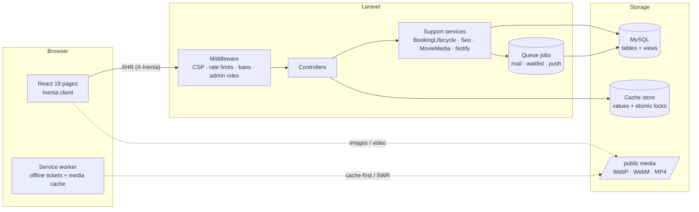
```mermaid
flowchart LR
    subgraph Browser
        R[React 19 pages<br/>Inertia client]
        SW[Service worker<br/>offline tickets + media cache]
    end

    subgraph Laravel
        MW[Middleware<br/>CSP · rate limits · bans · admin roles]
        C[Controllers]
        S[Support services<br/>BookingLifecycle · Seo · MovieMedia · Notify]
        Q[(Queue jobs<br/>mail · waitlist · push)]
    end

    subgraph Storage
        DB[(MySQL<br/>tables + views)]
        CA[(Cache store<br/>values + atomic locks)]
        FS[/public media<br/>WebP · WebM · MP4/]
    end

    R -- "XHR (X-Inertia)" --> MW --> C --> S
    S --> DB
    C --> CA
    S --> Q --> DB
    SW -. cache-first / SWR .-> FS
    R -. images / video .-> FS
```

Every page is a React component rendered by Inertia: the first request returns HTML with the page data inlined, later navigation swaps JSON only, so there are no full page reloads. Titles, meta tags, Open Graph and JSON-LD are still rendered on the server for crawlers.

## Data model

The schema has 56 tables and 9 reporting views. The diagram shows the booking core; supporting tables (sessions, jobs, cache, audit and security logs, CMS pages, FAQs, settings, bans) are listed underneath.


```mermaid
erDiagram
    CITIES ||--o{ THEATERS : "has"
    THEATERS ||--o{ SCREENS : "has"
    THEATERS }o--o{ AMENITIES : "theater_amenity"
    SCREENS ||--o{ SEATS : "has"
    SEAT_CATEGORIES ||--o{ SEATS : "classifies"

    MOVIES ||--o{ SHOWS : "screened as"
    SCREENS ||--o{ SHOWS : "hosts"
    MOVIES }o--o{ GENRES : "movie_genres"
    MOVIES ||--o{ MOVIE_CREDITS : "credits"
    PEOPLE ||--o{ MOVIE_CREDITS : "appears in"
    SHOWS ||--o{ SHOW_SEAT_ROW_PRICES : "priced by row"
    SHOWS ||--o{ SHOW_SEAT_PRICES : "priced by category"

    USERS ||--o| CARTS : "holds"
    CARTS ||--o{ CART_ITEMS : "contains"
    CART_ITEMS }o--|| SEATS : "holds seat"
    CART_ITEMS }o--|| SHOWS : "for show"

    USERS ||--o{ BOOKINGS : "makes"
    SHOWS ||--o{ BOOKINGS : "sold for"
    BOOKINGS ||--o{ BOOKING_SEATS : "tickets"
    BOOKING_SEATS }o--|| SEATS : "occupies"
    BOOKINGS ||--o| PAYMENTS : "settled by"
    BOOKINGS ||--o{ BOOKING_SPLITS : "split into"
    BOOKINGS ||--o{ BOOKING_EVENTS : "timeline"
    BOOKINGS }o--o{ CONCESSIONS : "booking_concessions"
    COUPONS |o--o{ BOOKINGS : "discounts"
    GIFT_CARDS |o--o{ BOOKINGS : "pays part of"
    COUPONS ||--o{ COUPON_USAGES : "used in"

    USERS ||--o{ REVIEWS : "writes"
    MOVIES ||--o{ REVIEWS : "receives"
    BOOKINGS |o--o{ REVIEWS : "verifies"
    REVIEWS ||--o{ REVIEW_PHOTOS : "has"
    REVIEWS ||--o{ REVIEW_VOTES : "helpful votes"

    USERS ||--o{ WISHLISTS : "watchlist"
    MOVIES ||--o{ WISHLISTS : "watched by"
    USERS ||--o{ SHOW_WAITLISTS : "queues"
    SHOWS ||--o{ SHOW_WAITLISTS : "waitlist"
    USERS ||--o{ LOYALTY_TRANSACTIONS : "earns / spends"
    USERS ||--o{ PUSH_SUBSCRIPTIONS : "devices"
    USERS ||--o{ NOTIFICATIONS : "inbox"

    ADMINS ||--o{ MOVIES : "created_by"
    ADMINS ||--o{ SHOWS : "created_by"
    ADMINS ||--o{ GIFT_CARDS : "issued_by"

    CITIES {
        bigint id PK
        varchar name
        varchar slug UK
        varchar province
        varchar timezone
    }
    THEATERS {
        bigint id PK
        bigint city_id FK
        varchar name
        varchar slug UK
        text address
        decimal latitude
        decimal longitude
        time opens_at
        time closes_at
        bool is_active
    }
    SCREENS {
        bigint id PK
        bigint theater_id FK
        varchar screen_name
        enum format "2d | imax | dolby_cinema | 4dx | screenx | recliner"
        smallint total_seats
        bool is_wheelchair_accessible
    }
    SEATS {
        bigint id PK
        bigint screen_id FK
        bigint seat_category_id FK
        char row_label "UK(screen_id, row_label, seat_number)"
        smallint seat_number
        bool is_active
    }
    SEAT_CATEGORIES {
        bigint id PK
        enum name UK
    }
    MOVIES {
        bigint id PK
        varchar slug UK
        varchar title
        text description
        smallint duration_minutes
        enum certificate_rating
        enum status "now_showing | coming_soon | ended"
        bool bookings_enabled
        json trailers
        decimal average_rating
        int total_reviews
        timestamp deleted_at "soft delete"
    }
    SHOWS {
        bigint id PK
        bigint movie_id FK
        bigint screen_id FK
        date show_date "UK(screen_id, show_date, show_time)"
        time show_time
        enum status "scheduled | ongoing | completed | cancelled"
        smallint total_seats
        smallint booked_seats
    }
    SHOW_SEAT_ROW_PRICES {
        bigint id PK
        bigint show_id FK
        char row_label "UK(show_id, row_label)"
        varchar tier_name
        decimal price
        decimal sale_price
        decimal kids_price
    }
    USERS {
        bigint id PK
        varchar username UK
        varchar email UK
        varchar phone UK
        int loyalty_points
        bool two_factor_enabled
        bool is_blocked
        varchar locale
        timestamp deleted_at "soft delete"
    }
    CARTS {
        bigint id PK
        bigint user_id FK "UK: one cart per user"
        timestamp expires_at "10-minute seat hold"
    }
    CART_ITEMS {
        bigint id PK
        bigint cart_id FK
        bigint show_id FK
        bigint seat_id FK "UK(seat_id, show_id)"
        enum ticket_type "adult | child"
        decimal price
    }
    BOOKINGS {
        bigint id PK
        varchar booking_number UK
        char idempotency_key UK
        bigint user_id FK
        bigint show_id FK
        bigint coupon_id FK
        bigint gift_card_id FK
        decimal subtotal
        decimal discount_amount
        decimal total_amount
        int points_redeemed
        int points_earned
        enum payment_method
        enum payment_status "pending | paid | refunded | failed"
        enum booking_status "confirmed | completed | cancelled | no_show"
        timestamp booked_at
    }
    BOOKING_SEATS {
        bigint id PK
        bigint booking_id FK
        bigint show_id FK
        bigint seat_id FK
        varchar ticket_number UK
        enum ticket_type
        decimal price_paid
        tinyint seat_lock "UK(show_id, seat_id, seat_lock): 1 = sold, NULL = released"
    }
    PAYMENTS {
        bigint id PK
        bigint booking_id FK "UK"
        enum payment_method
        decimal amount
        enum status
        varchar transaction_reference
        timestamp paid_at
        timestamp refunded_at
    }
    BOOKING_SPLITS {
        bigint id PK
        bigint booking_id FK
        char token UK
        decimal amount
        enum status
        bool is_host
    }
    COUPONS {
        bigint id PK
        varchar code UK
        enum discount_type
        decimal discount_value
        int max_uses
        int used_count
        datetime valid_until
    }
    GIFT_CARDS {
        bigint id PK
        varchar code UK
        decimal initial_balance
        decimal balance
        timestamp expires_at
    }
    CONCESSIONS {
        bigint id PK
        varchar slug UK
        varchar name
        decimal price
        int stock
        int low_stock_at
    }
    REVIEWS {
        bigint id PK
        bigint user_id FK "UK(user_id, movie_id)"
        bigint movie_id FK
        bigint booking_id FK "verified purchase"
        tinyint rating
        text review_text
        int helpful_count
        bool is_approved
    }
    SHOW_WAITLISTS {
        bigint id PK
        bigint show_id FK "UK(show_id, user_id)"
        bigint user_id FK
        tinyint seats_wanted
        timestamp notified_at
    }
    ADMINS {
        bigint id PK
        varchar email UK
        enum role "superadmin | admin | box_office"
        text two_factor_secret "encrypted"
        bool is_active
    }
```

<details>
<summary><strong>Supporting tables and reporting views</strong></summary>

| Group | Tables |
| --- | --- |
| Catalogue | `genres`, `movie_genres`, `people`, `movie_credits`, `amenities`, `theater_amenity`, `show_seat_prices` |
| Commerce | `coupon_usages`, `booking_concessions`, `booking_events`, `loyalty_transactions` |
| Community | `review_photos`, `review_votes`, `wishlists`, `notifications`, `push_subscriptions` |
| Admin | `admin_notifications`, `admin_password_resets`, `audit_logs`, `content_pages`, `faqs`, `site_settings`, `contact_messages` |
| Security | `banned_ips`, `banned_devices`, `user_devices`, `security_events`, `password_reset_tokens`, `sessions` |
| Framework | `cache`, `cache_locks`, `jobs`, `job_batches`, `failed_jobs`, `migrations` |

| View | Used for |
| --- | --- |
| `v_seat_availability` | Seat map: every seat of a show as `available`, `held` or `booked` |
| `v_show_details` | A show joined with its film, screen, cinema and city |
| `v_show_occupancy` | Seats sold vs. capacity per show |
| `v_booking_details` | Booking with customer, film, cinema and payment |
| `v_daily_revenue` | Revenue per day for the analytics charts |
| `v_movie_stats`, `v_user_stats`, `v_coupon_stats` | Admin reporting |
| `v_theater_catalog` | Cinemas with their city, for listings and the footer |

</details>

## Booking lifecycle

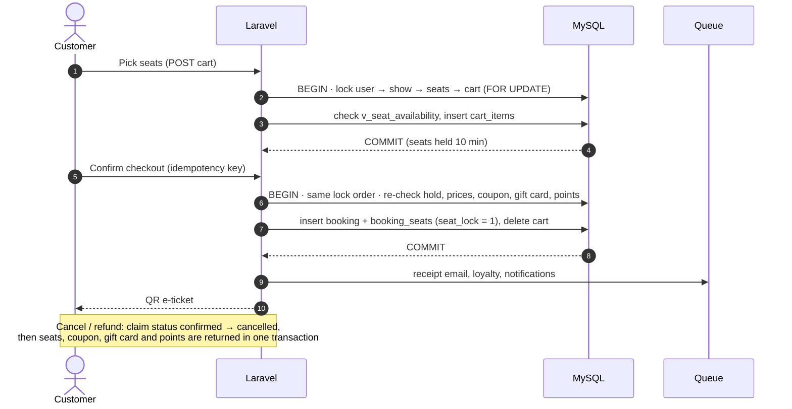
```mermaid
sequenceDiagram
    autonumber
    actor C as Customer
    participant App as Laravel
    participant DB as MySQL
    participant Q as Queue

    C->>App: Pick seats (POST cart)
    App->>DB: BEGIN · lock user → show → seats → cart (FOR UPDATE)
    App->>DB: check v_seat_availability, insert cart_items
    DB-->>App: COMMIT (seats held 10 min)
    C->>App: Confirm checkout (idempotency key)
    App->>DB: BEGIN · same lock order · re-check hold, prices, coupon, gift card, points
    App->>DB: insert booking + booking_seats (seat_lock = 1), delete cart
    DB-->>App: COMMIT
    App->>Q: receipt email, loyalty, notifications
    App-->>C: QR e-ticket
    Note over C,App: Cancel / refund: claim status confirmed → cancelled,<br/>then seats, coupon, gift card and points are returned in one transaction
```

Status moves are one-way and guarded:

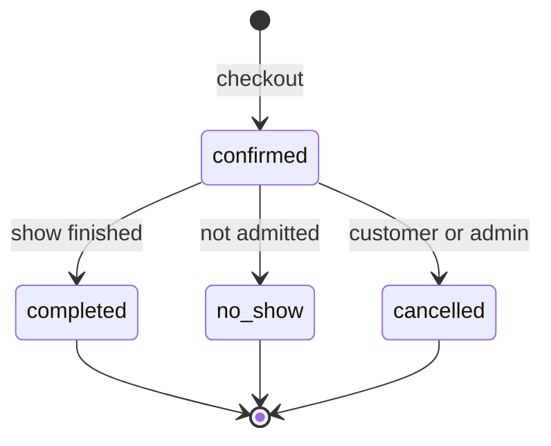
```mermaid
stateDiagram-v2
    [*] --> confirmed: checkout
    confirmed --> completed: show finished
    confirmed --> no_show: not admitted
    confirmed --> cancelled: customer or admin
    completed --> [*]
    no_show --> [*]
    cancelled --> [*]
```

## Concurrency and locking

Selling the same seat twice is the one bug a ticketing site cannot have, so it is prevented at several levels:

| Level | Mechanism | Where |
| --- | --- | --- |
| **Row locks (pessimistic)** | `SELECT … FOR UPDATE` inside a transaction, always in the same order (user → show → seats → cart) so two requests can never deadlock each other | `AccountController@addToCart`, `@checkout`, cart edits, `BookingLifecycle`, payment callbacks, split payments, gift card redemption, snack stock, staff role changes, password resets |
| **Status lock (optimistic compare-and-set)** | `Booking::claimStatus()` runs `UPDATE … WHERE id = ? AND booking_status = <expected>` and throws `StaleStatusException` if no row matched. Allowed moves live in `Booking::STATUS_TRANSITIONS`, so a cancelled booking can never be refunded twice | `BookingLifecycle::unwind()` |
| **Unique constraints** | `booking_seats (show_id, seat_id, seat_lock)`: `seat_lock` is `1` while sold and `NULL` once released, so MySQL itself refuses a second live ticket for a seat. Also `cart_items (seat_id, show_id)`, `reviews (user_id, movie_id)`, `show_waitlists (show_id, user_id)` | Schema |
| **Idempotency keys** | Checkout carries a client-generated key (`bookings.idempotency_key`, unique); a retried or double-clicked submit returns the booking it already made | Checkout |
| **Guarded updates** | "Tell the watchlist once" and counters use conditional `UPDATE`s (`WHERE booking_opened_notified_at IS NULL`, `WHERE booked_seats >= n`) | `Movie::booted`, `BookingLifecycle` |
| **Atomic cache locks** | `ProcessShowWaitlist` is `ShouldBeUnique` (per show) and uses `WithoutOverlapping`; scheduled tasks use `withoutOverlapping()`; `Cache::flexible` takes a lock so only one request rebuilds a stale value | Jobs, scheduler, cache |
| **Deadlock retry** | Booking transactions run with `DB::transaction(…, 3)`, retrying up to three times on a deadlock | Booking and refund paths |

## Caching

Requests pass through five cache layers, from closest to the user to closest to the data:

| Layer | What is cached | Lifetime and invalidation |
| --- | --- | --- |
| **1. Browser / CDN (HTTP)** | Vite assets (`/build/assets`), fonts | `max-age=31536000, immutable`: file names change on every build |
| | Film art, trailers (`/images/movies`, `/videos/trailers`) | 30 days plus a week of `stale-while-revalidate` (`public/.htaccess`) |
| | HTML and JSON | Never shared (live seat counts, session cookies); `/assistant/context` is `private, no-store` when signed in and `private, max-age=60` for guests |
| **2. Service worker** | App shell, build assets, icons | Cache-first (`bmm-shell-v3`, `bmm-assets`) |
| | Film art, share images, trailer stills | Stale-while-revalidate, capped at 120 entries (`bmm-media`) |
| | Booking pages | Network-first with offline fallback; wiped on sign-out (`bmm-tickets`) |
| **3. Application cache** | Home rails and stats, navbar films, footer genres and cinemas | `Cache::flexible` (fresh for 5–60 min, then served stale while one locked request rebuilds). Cleared by model events whenever a film changes (`Movie::LISTING_CACHE_KEYS`) |
| | Site settings, ban lists, assistant facts, admin analytics | `Cache::remember`, 1–10 minutes, cleared on write |
| **4. Per-request memo** | Layout data shared by every Inertia response | `LayoutData::remember()`: computed once per request |
| **5. Database** | Reporting views and composite indexes | Views keep the seat map and dashboards to one query each |

Use `CACHE_STORE=redis` (and `SESSION_DRIVER=redis`, `QUEUE_CONNECTION=redis`) in production; the database store works for local development and supports the same atomic locks through the `cache_locks` table.

## Performance and media

- **Images** are WebP in two sizes (`card.webp` 1200 px + `card-sm.webp` 640 px, `hero.webp` 1600 px + `hero-sm.webp` 960 px) served with `srcset`/`sizes`, explicit width and height (no layout shift), `loading="lazy"` below the fold and `fetchpriority="high"` on the one image that is the largest paint.
- **LCP preload**: film pages and the home page emit `<link rel="preload" as="image" imagesrcset=…>` from the server, so the key image starts downloading before JavaScript runs.
- **Trailers** ship as VP9 WebM (tried first), H.264 MP4 with fast-start (fallback) and a WebP still. They autoplay muted only when motion is allowed, Data Saver is off and the connection is faster than 3G; otherwise the still is shown.
- **Code splitting**: every page and the Three.js scenes are separate chunks.

## Security

- Strict nonce-based Content-Security-Policy, HSTS, `X-Frame-Options: DENY`, `nosniff` and a locked-down `Permissions-Policy`.
- Rate limits on every sensitive route; account, IP and device bans; disposable-email blocking; a single-use image code; invisible reCAPTCHA v3 with the v2 checkbox shown only as a step-up when v3 is unsure (never two captchas at once).
- Argon2id password hashing, optional emailed two-step codes for customers and TOTP for staff; admin roles enforced per route.
- HMAC-signed ticket QR codes, signed payment callbacks, uploads re-encoded with metadata stripped.
- Usher accepts no free text; its data endpoint takes no input, is rate limited and returns personal data only to the signed-in owner with `no-store`.

## Getting started

**Requirements:** PHP 8.2+ with `gd`, `intl`, `pdo_mysql` and `openssl`; Composer 2; Node 20+; MySQL 8 or MariaDB 10.4+.

```bash
git clone https://github.com/ahmershahdev/bookmymovie.git
cd bookmymovie

composer install
npm install

cp .env.example .env
php artisan key:generate
```

Set the database in `.env` (`DB_CONNECTION`, `DB_DATABASE`, …), then:

```bash
php artisan migrate --seed    # films, cinemas, shows, artwork and trailers
npm run build                 # or: npm run dev
php artisan serve
```

Open <http://127.0.0.1:8000>. The seeded owner account is `admin@bookmymovie.ahmershah.dev` (password from `BOOKMYMOVIE_ADMIN_PASSWORD`, default `Admin@1234`; change it before going live).

### Background work

Emails, waitlist alerts and push notifications are queued. Run a worker:

```bash
php artisan queue:work --tries=3
```

Or let the scheduler drain the queue every minute (it also clears expired seat holds and alerts waitlists):

```cron
* * * * * php /path/to/artisan schedule:run
```

### SEO files

`sitemap.xml`, `llms-full.txt` and the Open Graph images are generated from the database:

```bash
php artisan seo:generate
```

## Configuration

Everything below is off until its keys are set; the site works without them.

| Feature | `.env` keys |
| --- | --- |
| Booking rules | `BOOKMYMOVIE_MAX_SEATS` (4), `BOOKMYMOVIE_CART_HOLD_MINUTES` (10), `BOOKMYMOVIE_CANCELLATION_CUTOFF` (120) |
| reCAPTCHA | `RECAPTCHA_V2_SITE_KEY`, `RECAPTCHA_V2_SECRET_KEY`, `RECAPTCHA_V3_SITE_KEY`, `RECAPTCHA_V3_SECRET_KEY` |
| Apple Wallet | `APPLE_WALLET_PASS_TYPE_ID`, `APPLE_WALLET_TEAM_ID`, `APPLE_WALLET_CERTIFICATE`, `APPLE_WALLET_CERTIFICATE_PASSWORD`, `APPLE_WALLET_WWDR` |
| Google Wallet | `GOOGLE_WALLET_ISSUER_ID`, `GOOGLE_WALLET_KEY_FILE` |
| Online payments | JazzCash, Easypaisa and card keys (see `config/payments.php`) |
| Social sign-in | `GOOGLE_CLIENT_ID`, `GOOGLE_CLIENT_SECRET`, `FACEBOOK_CLIENT_ID`, `FACEBOOK_CLIENT_SECRET` |
| Web push | `VAPID_PUBLIC_KEY`, `VAPID_PRIVATE_KEY` (generate with `php artisan push:keys`), `VAPID_SUBJECT` |

## Film artwork and trailers

Drop files into `public/` using the film's slug, then run `php artisan migrate` (or re-seed). `App\Support\MovieMedia` links whatever it finds:

```text
public/images/movies/{slug}/card.webp       4:3 card (1200×900) + card-sm.webp (640 px)
public/images/movies/{slug}/hero.webp       16:9 backdrop (1600×900) + hero-sm.webp (960 px)
public/videos/trailers/{slug}-1.mp4         first trailer, H.264 + AAC, fast-start
public/videos/trailers/{slug}-1.webm        same cut in VP9 + Opus (about a third smaller)
public/videos/trailers/{slug}-1.webp        still shown before playback
public/videos/trailers/{slug}-2.*           optional second cut
```

Recommended encodes (720p, 24 fps):

```bash
ffmpeg -i in.mp4 -c:v libx264 -preset slow -crf 27 -pix_fmt yuv420p -movflags +faststart -c:a aac -b:a 96k {slug}-1.mp4
ffmpeg -i in.mp4 -c:v libvpx-vp9 -b:v 0 -crf 36 -row-mt 1 -c:a libopus -b:a 80k {slug}-1.webm
ffmpeg -ss 3 -i in.mp4 -frames:v 1 -c:v libwebp -quality 72 {slug}-1.webp
```

A film without a card falls back to its hero, then to a generated typographic poster, so nothing shows an empty box. Admin uploads are never overwritten.

## Project layout

```text
app/Http/Controllers/     Public, movie, cinema, account, auth, payment, ticket and admin controllers
app/Http/Middleware/      Security headers, abuse shield, bans, admin roles
app/Jobs/                 Waitlist alerts (unique + non-overlapping)
app/Support/              Booking lifecycle, SEO, media, wallet passes, mail, TOTP, text rules
app/Exceptions/           StaleStatusException (status lock conflicts)
database/migrations/      Schema, reporting views and data migrations
resources/js/pages/       Inertia pages (Home, Movies, Account, Admin, Auth, Public)
resources/js/components/  UI kit, shell (navbar, footer, Usher), trailer player, reviews, QR code
resources/js/three/       Poster ring, projector intro and the 3D cinema hall
resources/js/lang/ur.ts   Urdu strings (English text is the key)
public/sw.js              Service worker: offline tickets, media cache, web push
public/llms.txt           Summary for AI assistants; llms-full.txt is generated
```

## Tests

```bash
php artisan test
```

Feature tests cover the booking flow, payments and signed URLs, bans and commerce rules, community features, group bookings, waitlists and admin roles.

## Contributing and security

See [CONTRIBUTING.md](CONTRIBUTING.md) for setup, conventions and the pull request checklist. Report vulnerabilities privately as described in [SECURITY.md](SECURITY.md).

## Licence

[MIT](LICENSE) © 2026 Syed Ahmer Shah. Policy pages and support copy were written for the project and should be reviewed before a production launch.
